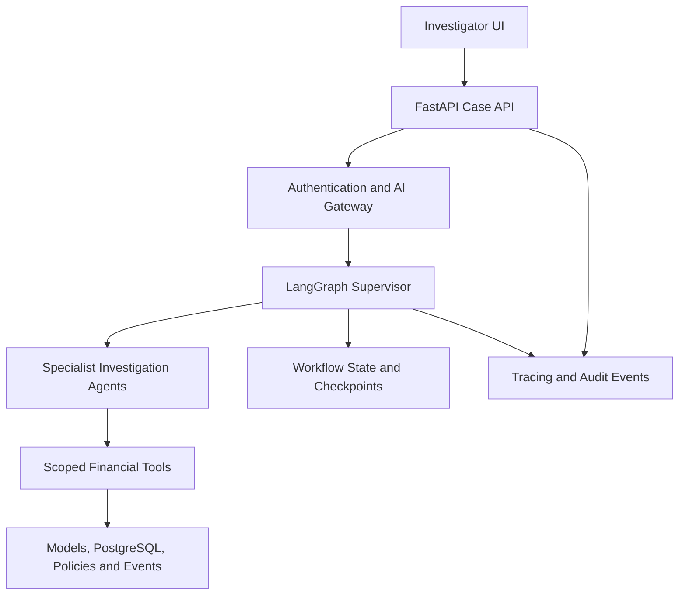

# AuraRisk

## AI Banking Risk and Fraud Investigation Platform

AuraRisk is a production-oriented, evidence-grounded investigation platform
for suspicious banking customers, accounts, transactions and repayment
behavior.

It combines traditional machine learning, financial analytics, policy
retrieval and governed multi-agent orchestration to generate auditable
investigation reports.

The platform is being developed incrementally as an enterprise-grade
portfolio project.

## Business Problem

Fraud and credit-risk investigators often need to combine information from
multiple disconnected systems:

- Customer and KYC records.
- Account and transaction histories.
- Fraud-detection models.
- Credit-risk models.
- Repayment histories.
- Internal lending and fraud policies.
- Previous investigation cases.

Manual evidence collection increases investigation time and can produce
inconsistent or difficult-to-audit decisions.

AuraRisk consolidates relevant evidence into a controlled investigation
workflow while retaining human authority over consequential decisions.

## Core Capabilities

Planned capabilities include:

- Reproducible synthetic financial data generation.
- Fraud-risk classification and credit probability-of-default models.
- Point-in-time transaction and repayment features.
- SHAP-based model explanations.
- Policy retrieval with hybrid search and citations.
- Governed multi-agent investigation with LangGraph.
- Least-privilege financial tools exposed through MCP.
- AI Gateway authentication, authorization and model-routing policies.
- Human approval for consequential recommendations.
- Kafka and PySpark streaming pipelines.
- Investigator-facing web application.
- End-to-end tracing, auditability and evaluation.
- Docker and Kubernetes deployment.

These capabilities are planned unless explicitly marked as implemented.

## High-Level Architecture



## Investigation Agents

The planned workflow includes:

- Customer Context Agent.
- Fraud Agent.
- Credit Risk Agent.
- Transaction Agent.
- Policy RAG Agent.
- Investigation Agent.
- Validator.
- Reporting Agent.

The supervisor determines which specialists are relevant to an investigation.

Independent specialist tasks may execute concurrently.

## Safety Boundaries

AuraRisk does not autonomously:

- Freeze an account.
- Approve or reject a loan.
- Change a credit limit.
- Transfer customer funds.
- Send external customer notifications.
- Submit an external regulatory filing.

High-impact internal recommendations require explicit human approval.

Account-hold recommendations require two authorized, distinct approvers.

All financial data used in the repository is synthetic.

## Repository Structure

```text
aurarisk-platform/
├── config/
│   ├── policies/
│   │   ├── action_approval_policy.yaml
│   │   └── outcome_action_mapping.yaml
│   └── quality/
│       └── release_gates.yaml
├── docs/
│   └── product/
│       ├── business_problem.md
│       ├── investigation_taxonomy.md
│       ├── gold_cases.yaml
│       ├── decision_and_approval_policy.md
│       └── non_functional_requirements.md
├── scripts/
│   └── validate_phase0.py
├── pyproject.toml
└── uv.lock
```

## Project Roadmap

| Phase | Focus |
|---|---|
| 0 | Product definition, gold cases, approval policies and release gates |
| 1 | Repository foundation, configuration, contracts and CI |
| 2 | Synthetic financial data |
| 3 | Feature engineering |
| 4 | Fraud and credit-risk models |
| 5 | Model serving and MLflow |
| 6 | Secure API and AI Gateway |
| 7 | Financial tool layer |
| 8 | Policy RAG |
| 9 | Multi-agent investigation |
| 10 | Validation and human approval |
| 11 | Kafka and PySpark streaming |
| 12 | Investigator UI |
| 13 | Evaluation and observability |
| 14 | Docker and Kubernetes deployment |

## Development Setup

This project uses `uv` for Python dependency management.

Install dependencies:

```bash
uv sync
```

Validate the Phase 0 product configuration:

```bash
uv run python scripts/validate_phase0.py
```

## Evaluation Strategy

AuraRisk is evaluated across multiple layers:

- Fraud-model quality.
- Credit-risk model discrimination and calibration.
- Policy-retrieval recall and citation correctness.
- Agent routing and evidence grounding.
- Human-approval enforcement.
- Performance and workflow recovery.
- Audit completeness.
- Cost per investigation.

The initial evaluation dataset contains 20 synthetic gold-case scenarios.

Targets are defined in:

```text
config/quality/release_gates.yaml
```

Targets represent engineering objectives and should not be interpreted as
already achieved performance.

## Current Status

Phase 0: Product discovery and investigation design.

No real customer data is included.

Model performance, latency and availability claims will be added only after
they have been measured.

## Disclaimer

This repository is a synthetic educational and portfolio project.

It is not a banking product, legal opinion, regulatory interpretation or
financial decision system.