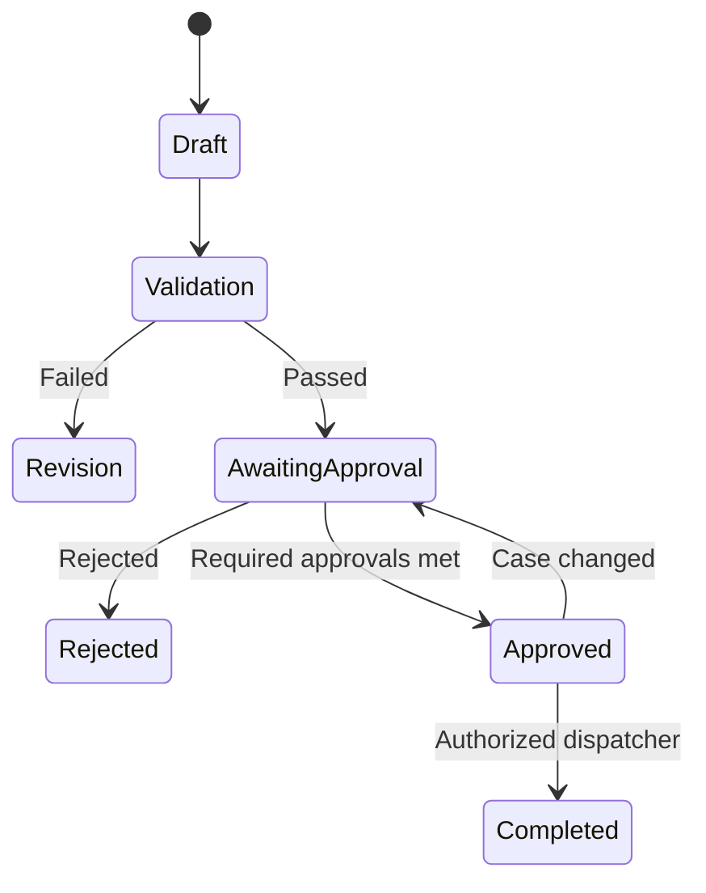

# AuraRisk Decision and Approval Policy

## 1. Purpose

This document defines the human-decision boundaries, approval requirements
and prohibited actions for AuraRisk.

AuraRisk is an investigation-support system. It can collect evidence,
execute approved read-only analytics, generate findings and recommend case
outcomes.

It cannot independently make or execute legally, financially or
operationally consequential customer decisions.

This is a synthetic portfolio policy and not legal or regulatory guidance.

## 2. Core Control Principles

### 2.1 Deny by Default

Any action not explicitly defined in the machine-readable approval policy
must be denied.

### 2.2 Human Authority

Only authenticated human users with an authorized role may approve a
consequential action.

An agent, service account or language model cannot act as an approver.

### 2.3 Least Privilege

Each user, agent and tool receives only the permissions required for its
defined responsibility.

### 2.4 Separation of Duties

A human who creates a high-impact recommendation cannot approve that same
recommendation when the policy requires maker-checker separation.

### 2.5 Evidence Before Action

An action cannot enter approval unless:

- Required evidence has been collected.
- The investigation synthesis is complete.
- Relevant policies have valid version metadata.
- All material conclusions reference evidence IDs.
- The deterministic validator passes.
- No blocking contradiction remains unresolved.

### 2.6 Approval Is Bound to a Case Version

An approval applies only to the exact:

- Case identifier.
- Case version.
- Recommended action.
- Recommendation version.
- Evidence snapshot.
- Model versions.
- Policy versions.

If any material input changes, the existing approval becomes stale.

### 2.7 Fail Closed

If authentication, authorization, validation, policy evaluation or audit
persistence fails, the action must not proceed.

## 3. Roles

### System Agent

A non-human workflow component.

Allowed responsibilities:

- Retrieve authorized evidence.
- Execute read-only analysis.
- Invoke registered model endpoints.
- Retrieve policies.
- Generate draft findings.
- Recommend an outcome.

A system agent cannot approve or execute consequential actions.

### Fraud Analyst

Allowed responsibilities:

- Review fraud investigations.
- Request additional evidence.
- Confirm low-risk fraud dispositions.
- Submit fraud escalations.
- Approve actions permitted to fraud analysts.

### Credit-Risk Analyst

Allowed responsibilities:

- Review credit-risk findings.
- Request additional evidence.
- Submit credit-risk escalations.
- Confirm repayment-support recommendations.

### Investigation Supervisor

Allowed responsibilities:

- Review fraud and credit-risk cases.
- Resolve conflicting findings.
- Approve high-risk internal escalations.
- Reject or return recommendations for revision.

### Compliance Reviewer

Allowed responsibilities:

- Review policy findings and policy exceptions.
- Approve policy escalations.
- Participate in critical-action maker-checker approval.

### Platform Administrator

Allowed responsibilities:

- Manage platform configuration.
- Manage user-role assignments.
- View service health and operational logs.

A platform administrator cannot approve a financial or fraud decision only
because they administer the platform.

### Auditor

Allowed responsibilities:

- Read completed case records.
- Read approval and audit histories.
- Verify model and policy versions.

An auditor cannot alter investigation outcomes.

## 4. Action Classes

### READ_ONLY

Examples:

- Read authorized case data.
- Execute feature calculations.
- Invoke a registered ML model.
- Retrieve a policy.
- Generate draft findings.

These actions may execute automatically but must be audited.

### LOW

Examples:

- Recommend continued monitoring.
- Recommend requesting additional evidence.
- Generate a draft report.

These recommendations can be generated automatically, but a human must
confirm the final case disposition.

### MEDIUM

Examples:

- Confirm an alert as cleared.
- Confirm repayment-support outreach.
- Create an internal policy-review task.

These actions require one authorized human confirmation.

### HIGH

Examples:

- Escalate a case to fraud operations.
- Escalate a case to credit-risk operations.
- Escalate a policy exception.
- Mark a customer for enhanced internal monitoring.

These actions require:

- Successful validation.
- One authorized human approval.
- No self-approval when maker-checker separation applies.
- A recorded rationale.

### CRITICAL

Examples:

- Submit an account-hold recommendation.
- Submit a recommendation that could materially restrict customer access.

These actions require:

- Successful validation.
- Complete required evidence.
- Two distinct human approvals.
- At least one supervisor approval.
- A documented rationale from each approver.
- A current, unexpired approval context.

AuraRisk records the approved recommendation. It does not apply a real
account hold in this portfolio implementation.

### PROHIBITED

The portfolio system must not execute:

- A real account freeze.
- A credit-limit change.
- A loan approval or rejection.
- A fund transfer.
- An external regulatory filing.
- A customer notification.
- Modification or deletion of completed audit records.

## 5. Approval Workflow

### Workflow Rules

1. An agent produces a recommendation.
2. The deterministic validator evaluates the case.
3. The policy engine classifies the requested action.
4. Prohibited actions are immediately denied.
5. Read-only actions may execute and are audited.
6. Approval-required actions enter `AWAITING_APPROVAL`.
7. The API verifies the approver's identity and role.
8. The system records the approval and rationale.
9. The policy engine checks whether all approvals are satisfied.
10. An authorized dispatcher records the approved internal action.
11. Every transition creates an audit event.

## 6. Approval Record Requirements

Every approval record must contain:

- Approval ID.
- Case ID.
- Case version.
- Action ID.
- Recommendation version.
- Approver user ID.
- Approver role.
- Decision: approved or rejected.
- Human-written rationale.
- Timestamp.
- Expiration timestamp.
- Evidence snapshot hash.
- Model-version set.
- Policy-version set.
- Request ID.
- Trace ID.

The approval record must not contain an editable copy of the evidence.

It references a versioned evidence snapshot instead.

## 7. Approval Invalidations

An existing approval becomes invalid if:

- New material evidence is added.
- Evidence is removed or corrected.
- The recommendation changes.
- The recommended action changes.
- The case version changes.
- A model is rerun with a different version.
- A cited policy version changes.
- Validation changes from pass to fail.
- The approval expires.
- The approver's authorization is revoked before execution.

Non-material UI changes do not invalidate approval.

## 8. Human Rationale

An approval or rejection rationale is mandatory.

Valid examples:

- "Device and beneficiary evidence corroborate account takeover indicators."
- "Customer travel notification explains the geographic anomaly."
- "Policy version is outdated; return case for updated policy retrieval."
- "Transaction evidence is incomplete; request beneficiary history."

Invalid examples:

- "Approved."
- "Model score is high."
- "Agent recommended it."
- An empty or automatically generated rationale.

The model may suggest a rationale summary, but a human must enter or
explicitly confirm the final rationale.

## 9. Validator Preconditions

Before an action can be approved, the validator must confirm:

- Every conclusion has at least one evidence reference.
- Every inference is labeled as an inference.
- Model outputs include model name and version.
- Policy findings include document, section and version.
- The policy is effective for the case date.
- Required evidence is present.
- No prohibited action has been requested.
- No unresolved blocking contradiction exists.
- The recommended outcome is supported by the investigation.
- Sensitive information is not exposed in generated text.

## 10. Concurrency Controls

The system must prevent two reviewers from approving different versions of
the same case.

Approval writes must include the expected case version.

If the stored case version differs, the API returns a version-conflict
response and requires the reviewer to reload the case.

The final internal action must use an idempotency key so retries cannot
create duplicate escalation records.

## 11. Audit Requirements

Every approval-related event must be append-only.

Required event types include:

- `RECOMMENDATION_CREATED`
- `VALIDATION_PASSED`
- `VALIDATION_FAILED`
- `APPROVAL_REQUESTED`
- `APPROVAL_GRANTED`
- `APPROVAL_REJECTED`
- `APPROVAL_EXPIRED`
- `APPROVAL_INVALIDATED`
- `ACTION_AUTHORIZED`
- `ACTION_DENIED`
- `ACTION_RECORDED`

Every event must contain a case ID, actor, timestamp, request ID and trace
ID.

## 12. Model and Agent Boundaries

The LLM or agent may:

- Explain evidence.
- Identify contradictions.
- Recommend an outcome.
- Suggest missing evidence.
- Draft a case report.

The LLM or agent may not:

- Assign itself a human role.
- Create an approval event.
- Modify the policy configuration.
- Directly invoke a consequential action.
- Declare a customer guilty of fraud.
- Conceal uncertainty or missing evidence.

## 13. Portfolio Execution Boundary

The following actions are represented only as internal workflow records:

- Fraud escalation.
- Credit-risk escalation.
- Policy escalation.
- Account-hold recommendation.
- Repayment-outreach recommendation.

No real customer account or external banking system is modified.